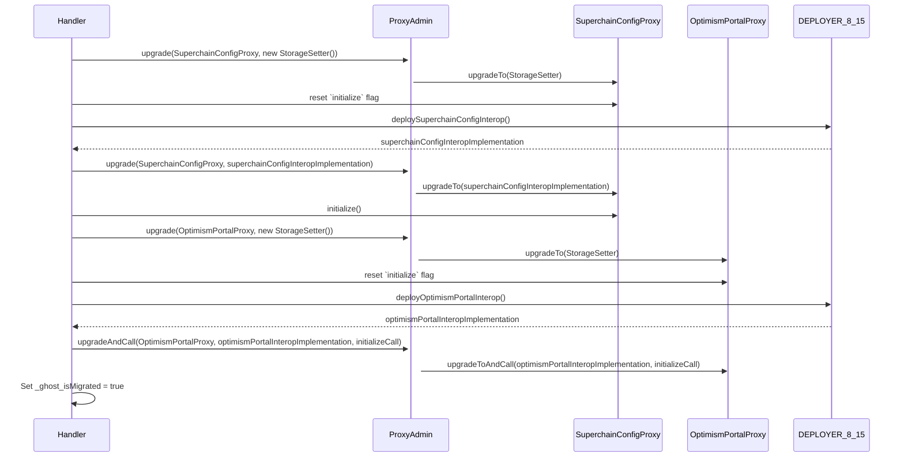

# Interop Advanced Testing Campaign Overview

This campaign involves deploying the following contracts:

### Architecture

**Testing Contracts**

- Setup: Contains the setup of the test.
- Handler: Contains the handlers of the test.
- FuzzTest: Where the properties are tested.
- SuperchainERC20ForToBProperties: Tests the `SuperchainERC20` ERC20 compliance using the ToB properties depdency. It is used as the `SuperchainERC20` implementation on the campaign.
- SuperchainWETHForToBProperties: Tests the `SuperchainWETH` ERC20 compliance using the ToB properties depdency. Only used for this specific case. On the rest of the campaign, the `SuperchainWETH` implementation is not modify to test the other properties.

**L1 Contracts**

- SuperchainConfig
- SharedLockbox
- SystemConfig
- OptimismPortal

**L2 Contracts (Predeploys)**

- ETHLiquidity
- L1BlockInterop
- CrossL2Inbox
- L2ToL2CrossDomainMessenger
- SuperchainTokenBridge
- L2ToL1MessagePasser
- SuperchainWETH
- SuperchainERC20

**Additional Infrastructure Contracts**

- ProxyAdmin
- Actors
- Deployer_8_15\*
- Deployer_8_25\*

\*The deployers are used to deploy contracts having dependencies with different compiler versions -- 0.8.15 and 0.8.25.
In this way, both contracts versions are compatible with each other.

---

### Overview

We deployed contracts within the constructor but initialized them using an `initialize()` modifier present in every test and handler. This approach was necessary because interacting with contracts directly in the constructor caused Medusa to crash.

In the constructor, we managed the deployment of both proxy and non-proxy contracts. For proxies, we deployed `src/universal/Proxy.sol`, setting `ProxyAdmin` as the owner and the target contract as the implementation. To avoid using the `prank` cheatcode—which can lead to issues in Medusa—we deployed `ProxyAdmin` as another actor.

In `_initializeProxies()`, we called `initialize()` on all proxies requiring initialization.

The `initialize()` modifier handled contract initialization and performed a `_setupSanityCheck()` to ensure the setup was correct.

---

### Migration Process

For the `SharedLockbox` properties, we managed two distinct states:

- Before enabling the Interop feature on L1
- After enabling the Interop feature on L1

We provided a `handler_migrateAndAddL1Dependency()` function, allowing the fuzzer to migrate the system across different states. This function migrated `SuperchainConfig` to `SuperchainConfigInterop`, `OptimismPortal` to `OptimismPortalInterop`, and called `addDependency()` to complete the migration process, including assertions to confirm success.

Since the sequencer was outside the scope of this campaign, we didn't focus on sharing a single state between L1 and L2. This allowed us to utilize a broader range of fuzzing values, helping identify complex edge cases.

We excluded function signatures that were broken in the `ToB/properties` dependency used to ensure ERC20 compliance. All breaking tests were reported.

---

**Additional Notes**

- To avoid using the `prank` cheatcode when sending some value on the next call, we deployed an actor to proxy necessary calls from specific addresses.
- Although portal mocks don't appear covered in the coverage report, we manually verified their coverage.
