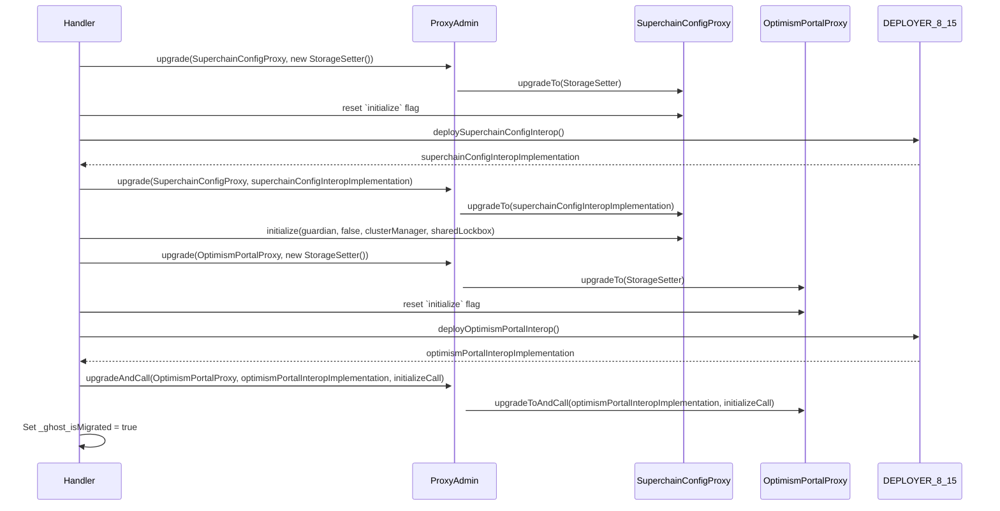

# Interop Advanced Testing Campaign Overview

The campaign consist of the following contracts being deployed:

**L1 Contracts**

- SuperchainConfigInterop
- SharedLockbox
- SystemConfig
- OptimismPortal

**L2 Contracts (Predeploys)**

- ETHLiquidity
- L1BlockInterop
- CrossL2Inbox
- L2ToL2CrossDomainMessenger
- SuperchainTokenBridge
- L2ToL1MessagePasser
- SuperchainWETH
- SuperchainERC20

**Additional infrastructure contracts:**

- ProxyAdmin
- Actors

While developing the setup, we had to deploy the contracts in the constructor but initialize them using an `initialize()` modifier that is present in every test and handler. This is because if we tried to interact with the contracts on the constructor, Medusa crashed.

On constructor, we deploy the contracts managing between those which are proxies and those which are not. For the proxies, we deploy the `src/universal/Proxy.sol`, setting the `ProxyAdmin` as the owner, and the contract being proxied as the implementation. At the same time, the `ProxyAdmin` is another actor so we avoid using `prank` cheatcode, that in Medusa, can lead to issues or unexpected behavior.

On `_initializeProxies()`, we initialize the proxies:
TODO: Add sequence diagram

On the `initialize()` modifier, we initialize the contracts, and then we check the setup worked well using the `_setupSanityCheck()` function.

It's important to mention that for the `SharedLockbox` properties, we manage 2 different states:

- Before the Interop feature is enabled on L1
- After the Interop feature is enabled on L1

We expose a `handler_migrateAndAddL1Dependency()` function so the fuzzer can migrate the system in different states. On it, we migrate the `SuperchainConfig` to `SuperchainConfigInterop`, the `OptimismPortal` to `OptimismPortalInterop`, and we call `addDependency()` to end up the migration process, having all the assrtions to ensure the process was done right.

Since the sequencer is not part of the scope of this campaign, we didn't really care about sharing a single state between the L1 and L2, which allowed us to use a wider range of fuzzing values to use - being benefitial to found complex edge cases.

We excluded function signatures being broke on the `ToB/properties` dependency used to ensure the ERC20 properties compliance. All of the breaking test were informed.

### Other Acknowledgements

- We had to avoid the `prank` cheatcode, that's why we deploy an actor to be able to proxy the call we needed by a given address.
- On the coverage the portal mocks don't appear to be covered, but we manually checked that they're.
